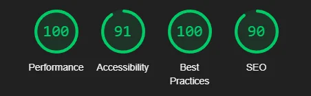

# Quiz Application

This is a fully functional and interactive Quiz Application that allows users to answer questions of various types, including multiple-choice, true/false, and fill-in-the-blank. At the end of the quiz, users receive a summary of their performance.

## Features

- **Responsive Design**: Designed with modern, mobile-first principles using Bootstrap.
- **Dynamic Question Loading**: Questions are fetched from a JSON file and displayed dynamically.
- **Randomized Questions**: The order of questions is randomized for a unique experience on each attempt.
- **Feedback Mechanism**: Immediate feedback is provided for correct and incorrect answers.
- **Final Summary**: A detailed summary shows the user's answers and correct answers at the end of the quiz.

## File Structure

### 1. `index.html`

The main HTML file that serves as the entry point for the application. It includes:

- Instruction Page: An introductory screen with quiz instructions.
- Quiz Page: The interactive section where questions are displayed and answered.
- Links to Bootstrap, custom CSS (`style.css`), and JavaScript (`script.js`).

### 2. `questions.json`

A JSON file containing the quiz questions and answers. It includes:

- **Fill-in-the-Blank Questions**: Questions where users type their answers.
- **Multiple-Choice Questions**: Questions with a list of possible answers, only one of which is correct.
- **True/False Questions**: Binary choice questions.

To add a new question:

1. Open the `questions.json` file.
2. Add a new question object with the required structure. For example:
   ```json
   {
     "type": "multiple-choice",
     "question": "What is the capital of Germany?",
     "answers": [
       { "text": "Berlin", "correct": true },
       { "text": "Paris", "correct": false },
       { "text": "Madrid", "correct": false },
       { "text": "Rome", "correct": false }
     ]
   }
   ```
3. Save the file.

To remove a question:

1. Locate the question in the `questions.json` file.
2. Delete the entire question object.
3. Save the file.

### 3. `script.js`

JavaScript code for the application's functionality:

- Displays instructions and navigates to the quiz page.
- Fetches and shuffles questions from `questions.json`.
- Handles user interactions (e.g., answering questions, submitting answers).
- Tracks scores and generates the final summary.

Feedback messages for correct and incorrect answers can be customized by editing the `correctFeedback` and `incorrectFeedback` arrays in `script.js`. For example:

```javascript
const correctFeedback = ["Amazing!", "Spot on!", "Correct!"];
const incorrectFeedback = [
  "Oops, that's not right.",
  "Try again!",
  "Incorrect answer.",
];
```

### 4. `style.css`

Custom CSS for styling the application:

- Defines color schemes, fonts, and layouts.
- Provides styles for buttons, input fields, and feedback messages.
- Enhances the visual appeal with animations and transitions.

## How to Play

1. Start the quiz by clicking the "Start Quiz" button on the instruction page.
2. Answer the displayed questions by selecting an option or typing in your response.
3. Click the "Next" button to proceed to the next question.
4. At the end of the quiz, view your score and a detailed summary of your performance.

## Technologies Used

- **HTML5**: Markup language for structuring the application.
- **CSS3**: For styling and layout, including responsive design.
- **JavaScript (ES6)**: Implements functionality and interactivity.
- **Bootstrap 5**: For responsive design and pre-styled components.

## Customization

- Modify the questions by editing `questions.json`.
- Customize the styles in `style.css` to align with your branding.
- Add new features or question types by extending `script.js`.
- Edit feedback messages in `script.js` for personalized responses.

## Future Improvements

- Add a timer for each question.
- Provide support for additional question types, such as matching and drag-and-drop.
- Improve visual appeal with advanced animations and transitions.
- Introduce a dark mode and other theme options for user preference.

## Lighthouse Report



### Why It's Important

- **Performance**: Ensures that the quiz loads quickly and efficiently, even on slower networks.
- **Accessibility**: Confirms that the application is usable by all users, including those with disabilities.
- **SEO**: Optimizes the application for better visibility in search engines.
- **Best Practices**: Verifies adherence to modern web development standards.

To generate a Lighthouse report, open the application in Google Chrome, access the Developer Tools (`Ctrl+Shift+I`), navigate to the Lighthouse tab, and click "Generate Report."

## License

This project is open-source and free to use for educational or personal purposes.
